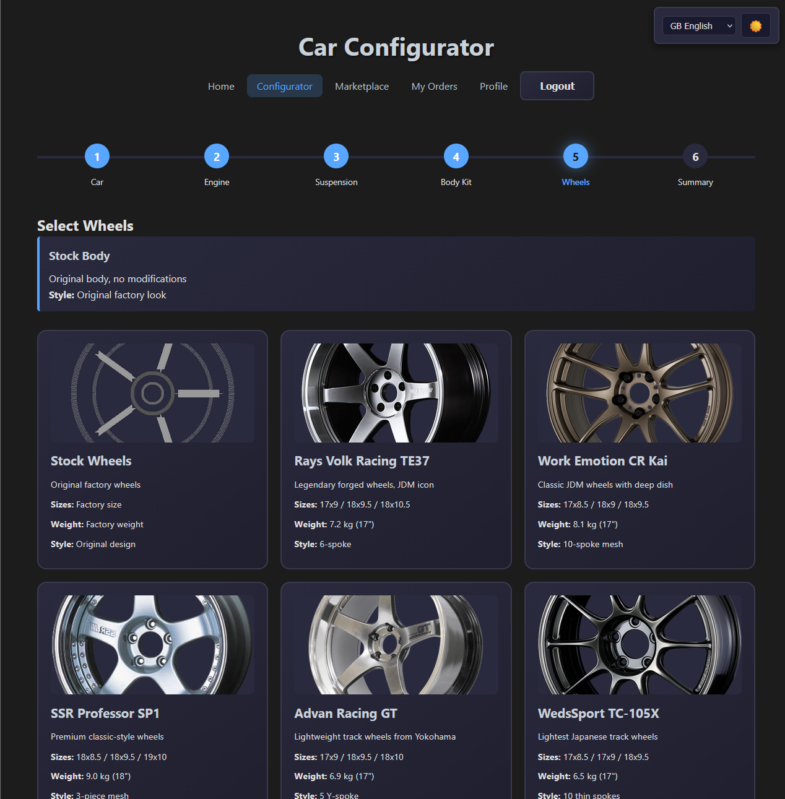
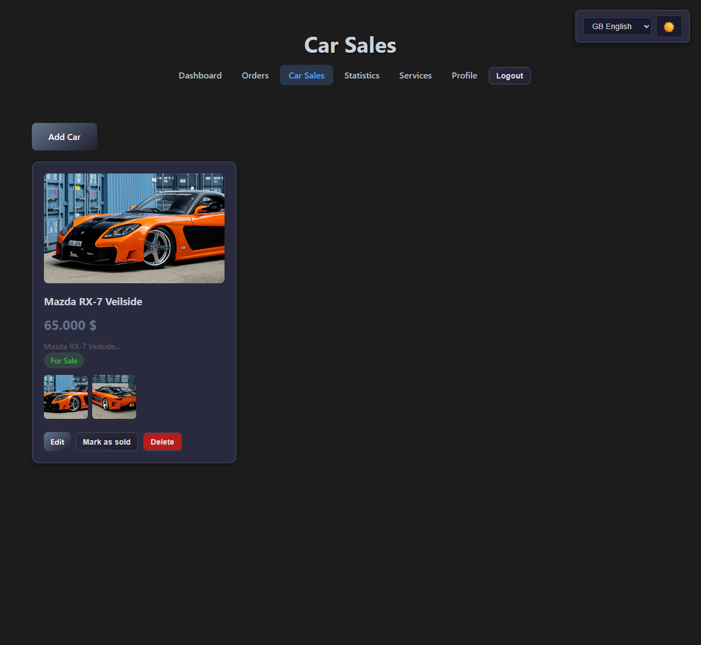
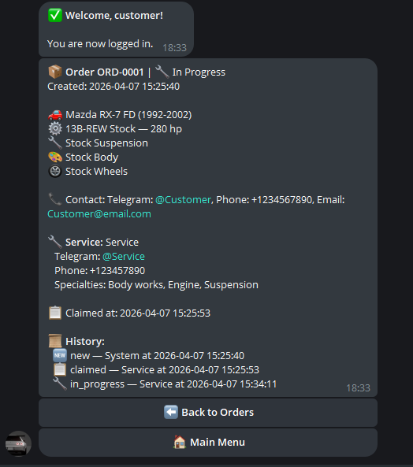

# JDM Car Configurator 🚗

A Telegram bot and web platform for ordering and configuring classic 90s/00s JDM cars with custom modifications.

---

## Demo

### Client Website - Car Configurator


### Client Website - Marketplace


### Telegram Bot


---

## Product Context

### End Users

- **Car Enthusiasts** — Fans of classic JDM cars (90s/00s era) who want to order and customize vehicles
- **Car Service Centers** — Technicians and shops that fulfill custom car build orders

### Problem

Enthusiasts of classic JDM cars lack a streamlined platform to:
- Browse available 90s/00s JDM models
- Configure custom builds (engine swaps, suspensions, bodykits, wheels)
- Place orders with service centers
- Track order progress

Service centers lack a centralized system to:
- Receive and manage custom build orders
- Claim jobs and communicate with clients
- Track statistics and workload

### Solution

A multi-platform system with:
- **Telegram Bot** — Quick access to order tracking and notifications
- **Client Website** — Interactive car configurator with step-by-step customization
- **Service Website** — Service center dashboard for order management and analytics

---

## Features

### Implemented ✅

#### Client Website (Port 5000)
- User registration and authentication
- Interactive car configurator with 10 JDM models:
  - Toyota Supra A80, Nissan Skyline R34 GT-R, Mazda RX-7 FD, Honda NSX
  - Nissan Silvia S15, Toyota Chaser JZX100, Honda Civic Type R EK9
  - Mitsubishi Lancer Evolution VI, Subaru Impreza WRX STI GC8, Toyota AE86
- Customization options:
  - **Engines** — 6 options per car (stock, built, stroker, swaps, custom)
  - **Suspensions** — 7 setups (stock, street, sport, drift, track, stance, custom)
  - **Bodykits** — 6 styles (stock, Rocket Bunny, VARIS, N1/Origin, Pandem, custom)
  - **Wheels** — 13 options (Rays Volk, Work, SSR, Advan, Enkei, BBS, OZ, etc.)
- 8 pre-configured preset builds (Drift, Track, Stance, Street, Rally, Touge)
- Order placement and tracking
- Marketplace for pre-modified cars for sale
- User profile management
- Mobile responsive design
- Internationalization (English & Russian)

#### Service Panel (Port 5001)
- Service center registration and authentication
- Order management (view, claim, release, update status)
- Per-service data isolation
- Statistics and analytics (order counts, popular cars, conversion rates)
- Service management (register, edit, deactivate services)
- Marketplace management (add/edit/remove cars for sale, image uploads)
- Service profile management

#### Telegram Bot
- User registration and authentication
- Order listing with status tracking
- Order detail view with full configuration
- Assigned service contact information
- Status history timeline

#### Infrastructure
- Docker containerization (3 services)
- Shared persistent storage (JSON-based database)
- Deployment scripts
- Health checks for all services

---

## Usage

### For Car Enthusiasts

1. **Via Website:**
   - Open `http://10.93.25.206:5000`
   - Register an account
   - Browse available JDM cars
   - Use the configurator to customize your build
   - Place an order and track its progress

2. **Via Telegram:**
   - Find the bot by its username
   - Send `/start` to begin
   - Register with username and password
   - View your orders and their status

### For Service Centers

1. Open `http://10.93.25.206:5001`
2. Register as a service center
3. Browse available orders
4. Claim orders you want to fulfill
5. Update order status as work progresses
6. View statistics on your dashboard

---

## Deployment

### Prerequisites

- **OS:** Ubuntu 24.04 (or any Linux with Docker support)
- **Docker** (version 20.10 or higher)
- **Docker Compose** (version 2.0 or higher)
- **Git**
- **Telegram account** (to create a bot via @BotFather)

## Architecture

```
┌─────────────────────────────────────────┐
│         Docker Network                  │
│                                         │
│  ┌──────────────┐                       │
│  │  jdm-bot     │ ← Telegram Bot        │
│  │  (Polling)   │    Polls Telegram API │
│  └──────┬───────┘                       │
│         │                               │
│  ┌──────┴───────┐  ┌──────────────────┐ │
│  │ jdm-client   │  │  jdm-admin       │ │
│  │ Port 5000    │  │  Port 5001       │ │
│  │ (Public)     │  │  (Password)      │ │
│  └──────┬───────┘  └──────┬───────────┘ │
│         │                  │             │
│  ┌──────┴──────────────────┴──────────┐ │
│  │      Shared Volume: bot_data       │ │
│  │      (JSON storage)                │ │
│  └────────────────────────────────────┘ │
└─────────────────────────────────────────┘
```

### Services

1. **jdm-bot** — Telegram bot (polling-based, no exposed port)
2. **jdm-client** — Client website (Port 5000)
3. **jdm-admin** — Service panel (Port 5001)

### Data Storage

JSON-based persistent storage shared via Docker volume:
- `orders.json` — All order data
- `users.json` — Client user accounts
- `services.json` — Service center accounts
- `for_sale_cars.json` — Marketplace listings

---

## Tech Stack

- **Backend:** Python 3.11, Flask 3.0+, python-telegram-bot 21.0+
- **Frontend:** HTML5, CSS3, Vanilla JavaScript (ES6+)
- **Containerization:** Docker + Docker Compose
- **Storage:** JSON files (file-based database)
- **Internationalization:** English & Russian

---

## License

This project is licensed under the MIT License — see the [LICENSE](LICENSE) file for details.
